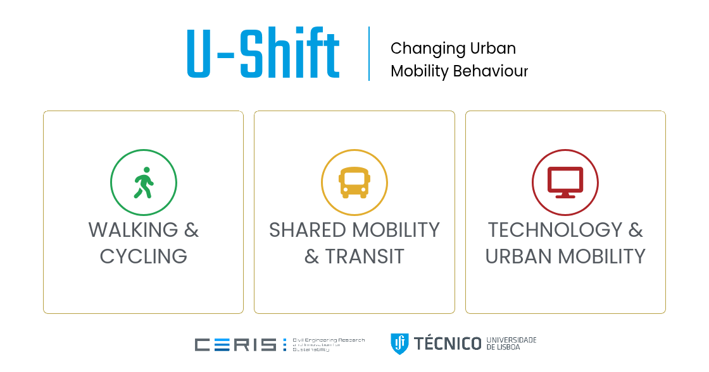

 

U-Shift belongs to the Transportation Systems Research Group from CERIS (Civil Engineering Research and Innovation for Sustainability), part of the Department of Civil Engineering, Architecture and Environment of Instituto Superior Técnico, University of Lisbon.

 
 

👥 Who we are → [ushift.pt/about](https://ushift.pt/about) | 🔍 What we do → [ushift.pt/projects](https://ushift.pt/projects)

📝 Publications → [ushift.pt/publications](https://ushift.pt/publications) | 🧰 Data & tools → [ushift.pt/data](https://ushift.pt/data)

